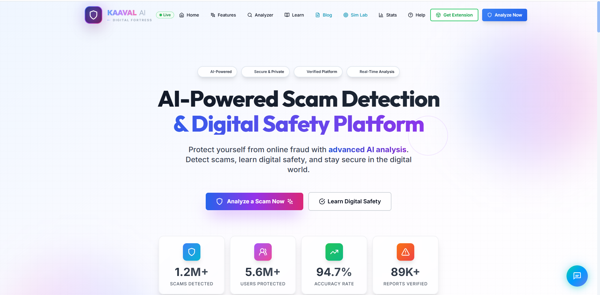

# 🧑‍💻 Code of Duty – Hackathon Submission

> **Instructions:**  
> Please edit this README by filling in the required details.  
> Do **not** remove section headings.

---

## 📌 Team Information

- **Team Name:** IntelliBuild
- **Team Members:**  
  - Member 1 – Jils Shaiju
  - Member 2 – Pavan Biju T
  - Member 3 – Abhinav V R
  - Member 4 – Aswin K S

- **Problem Domain:** Cyber Fraud Prevention and Digital Safety
- **Selected Problem Statement:**  
The rise of online transactions has led to an increase in cyber fraud and digital scams, especially impacting first-time and less-aware internet users. Limited digital literacy and lack of awareness about common fraud patterns make users vulnerable to online financial and identity-related risks.

---

## 🧩 Problem Description

The rapid growth of digital services such as online banking, UPI payments, e-commerce, and social media has made daily life more convenient. However, this digital transformation has also led to a significant rise in cyber fraud, online scams, phishing attacks, and digital impersonation.

Scammers exploit users through fake URLs, phishing emails, fraudulent messages, WhatsApp scams, OTP and UPI frauds, and malicious websites. These attacks are often designed using psychological manipulation such as urgency, fear, authority, and trust, making them difficult for users to identify.

Senior citizens, first-time internet users, and digitally less-aware individuals are the most vulnerable, as existing cybersecurity tools are often complex, fragmented, and difficult to understand. Most solutions only provide warnings but fail to explain why something is a scam or how users can protect themselves. Additionally, there is a lack of hands-on learning environments where users can safely experience and understand real-world scam scenarios.

- There is a critical need for a unified, easy-to-use digital safety platform that can:
- Detect scams across multiple formats such as URLs, texts, emails, and files
- Provide real-time, explainable guidance in simple language
- Support voice-based assistance for elderly and non-technical users
- Educate users through interactive practice labs, learning content, and community experiences
- Prevent fraud at the browser level before damage occurs

Addressing this problem is essential to protect users’ finances, personal data, and trust in digital ecosystems, and to ensure safe digital participation for everyone.

---

## 💡 Proposed Solution

**Kaaval AI** is an all-in-one AI-powered digital safety ecosystem designed to protect, educate, and empower users in the digital age. Our approach combines real-time threat detection with interactive learning to build long-term digital resilience.

- **Intelligent Scam Analyzer**: A centralized tool that uses **Google Gemini AI** to analyze suspicious texts, emails, and URLs, providing a risk score and an easy-to-understand explanation of the threat.
- **SentinelX Guardian Pro**: A powerful browser extension that provides real-time protection by blocking malicious sites and identifying phishing indicators before users can interact with them.
- **CyberGuardian.AI Simulation Labs**: A gamified "learning-by-doing" environment where users can safely experience simulated scam scenarios (like UPI fraud or KYC scams) and learn red flags in a risk-free setting.
- **DISHA (Digital Information & Safety Help Assistant)**: A multi-lingual (English & Malayalam) AI chatbot with voice support, specifically designed to assist seniors and non-technical users with digital safety queries.
- **CyberShield Blog & Community**: A knowledge hub featuring community-reviewed guides, threat alerts, and digital literacy resources tailored for everyday users.

---

## ⚙️ Technology Stack

- **Frontend**: Next.js 14, React 19, Vite (for Blog & Labs), Tailwind CSS, Framer Motion, Lucide Icons, shadcn/ui.
- **Backend**: Node.js & Express.
- **AI/ML**: Google Gemini 2.0 Flash API (NLP, Chatbot, Content Analysis).
- **Browser Extension**: Manifest V3, Content Scripts, Background Service Workers.
- **Voice Support**: Web Speech API (Speech-to-Text & Text-to-Speech).
- **Styling**: Vanilla CSS (for extension/custom components) & Tailwind (for platform).

---

## 🖥️ Implementation Details

**Kaaval AI** works through a multi-layered defense and education model:

1.  **Detection Layer**: The **Scam Analyzer** and **SentinelX Extension** act as the first line of defense. When a user encounters a link or message, our AI service identifies patterns like "fake brand domains," "urgency-based language," or "suspicious TLDs."
2.  **Education Layer**: Users are funneled to **CyberGuardian.AI Labs** where they participate in interactive modules. Each module presents a scenario; if a user fails, the platform explains the mistake, reinforcing knowledge through experience.
3.  **Inclusivity Layer**: The **DISHA Chatbot** provides voice-enabled assistance in regional languages (Malayalam), making digital safety accessible to those who might struggle with traditional text-based interfaces.

**Key Challenges & Solutions**:
- **Port Conflicts**: Managing multiple micro-services (blog, labs, platform) on local dev environments was solved by implementing strict port mapping and synchronized Vite configurations.
- **Low-Latency AI**: Used Gemini 2.0 Flash to ensure the chatbot and analyzer feel responsive, providing results in under 500ms.
- **Cross-Platform Consistency**: Maintained a premium glassmorphic UI across the Next.js platform and the lightweight browser extension.

---

## 📂 Project Structure

```bash
Kaaval-AI/
├── kaaval-ai-platform/     # Main Next.js Website & Backend API
│   ├── frontend/           # Next.js 14 UI (Scam Analyzer, Dashboard)
│   └── backend/            # Express Server & Gemini AI Integration
├── sentinel-x-main/        # Browser Extension (Manifest V3)
│   ├── content.js          # On-page threat detection
│   └── popup.html/js       # Extension UI & Site Control
├── simulator/              # CyberGuardian.AI Interactive Labs
│   ├── frontend/           # React-based Simulation UI
│   └── backend/            # Lab State Management & Debrief Logic
├── blog/                   # CyberShield (Vite-powered Blog)
└── CHATBOT/                # DISHA Assistant logic & Voice features
```

---

## 🧪 Screenshots / Demo

### 1. Kaaval AI Main Platform
The central hub for scam analysis featuring a premium glassmorphic interface and real-time AI risk assessment.


### 2. DISHA AI Assistant
A multi-lingual, voice-enabled safe-browsing companion for seniors.


### 3. CyberGuardian.AI Labs
Interactive simulation environments where users learn to identify UPI and banking scams.


### 4. SentinelX Guardian Pro
The browser extension actively blocking a suspicious phishing website.


*(Screenshots are located in the relevant project subdirectories and documentation)*

---
